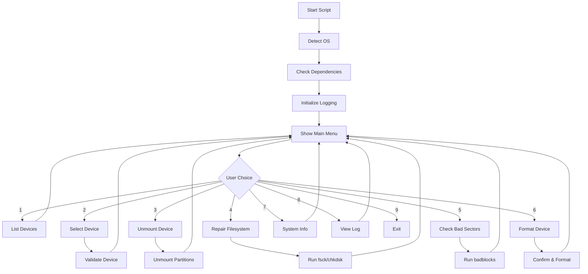

<div align="center">

[](https://xbibzofficial.netlify.app)

# 🛠️ XBIBZ RECOVERY FLASHDISK REPAIR TOOL

<p align="center">
  
  
  
  
</p>

<p align="center">
  <b>Tool Recovery Profesional untuk Memperbaiki Flashdisk Corrupt</b><br>
  <i>Mendukung Multi-Platform: Linux, macOS, dan Windows</i>
</p>

<p align="center">
  <a href="#-features">Features</a> •
  <a href="#-installation">Installation</a> •
  <a href="#-usage">Usage</a> •
  <a href="#-documentation">Documentation</a> •
  <a href="#-troubleshooting">Troubleshooting</a>
</p>

---

</div>

## 📋 Daftar Isi

- [Tentang](#-tentang)
- [Features](#-features)
- [System Requirements](#-system-requirements)
- [Installation](#-installation)
- [Usage](#-usage)
- [Documentation](#-documentation)
- [Cara Kerja](#-cara-kerja)
- [Troubleshooting](#-troubleshooting)
- [FAQ](#-faq)
- [Contributing](#-contributing)
- [License](#-license)
- [Author](#-author)

---

## 🎯 Tentang

<div align="center">
<table>
<tr>
<td width="60%">

**Xbibz Recovery Flashdisk Repair Tool** adalah aplikasi berbasis bash script yang dirancang khusus untuk membantu Anda memperbaiki flashdisk yang corrupt, rusak, atau bermasalah. Tool ini hadir dengan antarmuka yang user-friendly dan mendukung berbagai sistem operasi.

### Kenapa Memilih Xbibz Recovery?

✅ **Multi-Platform** - Bekerja di Linux, macOS, dan Windows  
✅ **Auto-Detection** - Deteksi OS dan perangkat secara otomatis  
✅ **Comprehensive Repair** - Berbagai metode perbaikan  
✅ **Detailed Logging** - Log lengkap untuk troubleshooting  
✅ **Safe Operations** - Konfirmasi sebelum operasi berbahaya  
✅ **Open Source** - Gratis dan dapat dikustomisasi  

</td>
<td width="40%">

```
╔════════════════════════╗
║    🔧 REPAIR TOOLS    ║
╠════════════════════════╣
║ ✓ Filesystem Check    ║
║ ✓ Bad Sector Scan     ║
║ ✓ Auto Mount/Unmount  ║
║ ✓ Format & Recovery   ║
║ ✓ System Diagnostics  ║
╚════════════════════════╝
```

</td>
</tr>
</table>
</div>

---

## ✨ Features

<div align="center">

<table>
<tr>
<td align="center" width="33%">

<br><b>🔍 Device Scanner</b><br>
<small>Scan dan deteksi semua storage devices yang terhubung</small>
</td>
<td align="center" width="33%">

<br><b>🔧 Filesystem Repair</b><br>
<small>Perbaiki filesystem yang corrupt dengan fsck/chkdsk</small>
</td>
<td align="center" width="33%">

<br><b>⚠️ Bad Sector Check</b><br>
<small>Deteksi dan tandai bad sectors pada storage</small>
</td>
</tr>
<tr>
<td align="center">

<br><b>💾 Auto Mount/Unmount</b><br>
<small>Kelola mounting device secara otomatis</small>
</td>
<td align="center">

<br><b>💿 Format Device</b><br>
<small>Format ulang dengan FAT32 untuk kompatibilitas maksimal</small>
</td>
<td align="center">

<br><b>📝 Detailed Logging</b><br>
<small>Log lengkap untuk setiap operasi yang dilakukan</small>
</td>
</tr>
</table>

</div>

---

## 💻 System Requirements

<div align="center">

| Platform | Requirements | Additional Tools |
|:--------:|:------------|:-----------------|
| 🐧 **Linux** | Bash 4.0+, Root access | `lsblk`, `fsck`, `badblocks`, `dosfstools` |
| 🍎 **macOS** | Bash 4.0+, Admin access | `diskutil`, `fsck_msdos` |
| 🪟 **Windows** | Git Bash / WSL, Admin rights | `diskpart`, `chkdsk`, `format` |

</div>

### Dependencies yang Dibutuhkan

#### Linux (Debian/Ubuntu)
```bash
sudo apt-get update
sudo apt-get install util-linux e2fsprogs dosfstools
```

#### Linux (Arch)
```bash
sudo pacman -S util-linux e2fsprogs dosfstools
```

#### macOS
```bash
# Tools sudah terinstall secara default
# Pastikan Xcode Command Line Tools terinstall
xcode-select --install
```

#### Windows (Git Bash)
```bash
# Jalankan Git Bash as Administrator
# Dependencies sudah tersedia di Windows
```

---

## 📦 Installation

<details>
<summary><b>🐧 Linux Installation</b></summary>

```bash
# Clone repository
git clone https://github.com/XbibzOfficial777/flashdisk-recovery.git

# Masuk ke direktori
cd flashdisk-recovery

# Berikan izin eksekusi
chmod +x fixcorrupt.sh

# Jalankan script (memerlukan sudo)
sudo ./fixcorrupt.sh
```

</details>

<details>
<summary><b>🍎 macOS Installation</b></summary>

```bash
# Clone repository
git clone https://github.com/XbibzOfficial777/flashdisk-recovery.git

# Masuk ke direktori
cd flashdisk-recovery

# Berikan izin eksekusi
chmod +x fixcorrupt.sh

# Jalankan script (memerlukan sudo)
sudo ./fixcorrupt.sh
```

</details>

<details>
<summary><b>🪟 Windows Installation</b></summary>

```bash
# Install Git untuk Windows dari https://git-scm.com/

# Buka Git Bash as Administrator

# Clone repository
git clone https://github.com/XbibzOfficial777/flashdisk-recovery.git

# Masuk ke direktori
cd flashdisk-recovery

# Jalankan script
./fixcorrupt.sh
```

</details>

---

## 🚀 Usage

### Quick Start

<div align="center">

```bash
# Jalankan dengan privileges
sudo ./fixcorrupt.sh
```

</div>

### Step-by-Step Guide

<table>
<tr>
<td width="50%">

#### 1️⃣ **Scan Devices**
```
[Menu Option 1]
Scan and list storage devices
```
Melihat semua storage devices yang terhubung ke sistem Anda.

#### 2️⃣ **Select Device**
```
[Menu Option 2]
Enter device name: sdb1
```
Pilih device yang ingin diperbaiki (contoh: `sdb1`, `disk2s1`, `D:`).

#### 3️⃣ **Unmount Device**
```
[Menu Option 3]
Unmount device
```
Unmount device sebelum melakukan repair.

</td>
<td width="50%">

#### 4️⃣ **Repair Filesystem**
```
[Menu Option 4]
Repair filesystem
```
Jalankan filesystem check dan repair.

#### 5️⃣ **Check Bad Sectors**
```
[Menu Option 5]
Check for bad sectors
```
Scan dan deteksi bad sectors pada device.

#### 6️⃣ **Format (Optional)**
```
[Menu Option 6]
Format device (WILL ERASE DATA)
```
Format ulang device jika repair tidak berhasil.

</td>
</tr>
</table>

---

## 📚 Documentation

### Menu Interface

<div align="center">

```
╔══════════════════════════════════════════════════════════╗
║                                                          ║
║           XBIBZ RECOVERY FLASHDISK REPAIR TOOL           ║
║                GitHub : @XbibzOfficial777                ║
║                                                          ║
╚══════════════════════════════════════════════════════════╝

Selected Device: sdb1

Please choose an option:
1. Scan and list storage devices
2. Select device for repair
3. Unmount device
4. Repair filesystem
5. Check for bad sectors
6. Format device (WILL ERASE ALL DATA)
7. Show system information
8. View repair log
9. Exit
```

</div>

### Fungsi-Fungsi Utama

<details>
<summary><b>🔍 Device Scanner</b></summary>

**Fungsi:** `list_devices()`

Menampilkan semua storage devices yang tersedia dengan informasi:
- Device name (sda, sdb, disk0, dll)
- Size / Kapasitas
- Type (disk, part)
- Mount point
- Filesystem type

**Output Linux:**
```
NAME   SIZE  TYPE MOUNTPOINT FSTYPE
sda    500G  disk
├─sda1 499G  part /          ext4
sdb     16G  disk
└─sdb1  16G  part            vfat
```

</details>

<details>
<summary><b>🔧 Filesystem Repair</b></summary>

**Fungsi:** `repair_filesystem()`

Melakukan perbaikan filesystem dengan tools native:
- **Linux:** `fsck` - File System Consistency Check
- **Windows:** `chkdsk` - Check Disk
- **macOS:** `diskutil repairVolume`

**Proses:**
1. Unmount device (otomatis)
2. Jalankan filesystem check
3. Perbaiki error yang ditemukan
4. Log hasil repair

**Return Codes (fsck):**
- 0: No errors
- 1: Filesystem errors corrected
- 2: System should be rebooted
- 4: Filesystem errors left uncorrected
- 8: Operational error

</details>

<details>
<summary><b>⚠️ Bad Sector Check</b></summary>

**Fungsi:** `check_bad_sectors()`

Mendeteksi bad sectors pada storage device:
- **Linux:** `badblocks` - Scan seluruh surface
- **Windows:** `chkdsk /r` - Locate bad sectors
- **macOS:** `diskutil verifyVolume`

**Catatan:** Proses ini memakan waktu tergantung ukuran device.

</details>

<details>
<summary><b>💿 Format Device</b></summary>

**Fungsi:** `format_device()`

Format device dengan FAT32 untuk kompatibilitas maksimal:
- **Label:** XBIBZ_RECOVERY
- **Filesystem:** FAT32
- **Partition:** MBR Format

⚠️ **WARNING:** Akan menghapus SEMUA data pada device!

</details>

---

## ⚙️ Cara Kerja

### Arsitektur System

<div align="center">



</div>

### Flowchart Repair Process

<table>
<tr>
<td>

```
┌─────────────────────┐
│   Start Repair      │
└──────────┬──────────┘
           │
           ▼
┌─────────────────────┐
│  Detect Device      │
│  & Validate         │
└──────────┬──────────┘
           │
           ▼
┌─────────────────────┐
│  Unmount Device     │
│  (if mounted)       │
└──────────┬──────────┘
           │
           ▼
┌─────────────────────┐
│  Run Filesystem     │
│  Check (fsck)       │
└──────────┬──────────┘
           │
           ▼
┌─────────────────────┐
│  Check Bad Sectors  │
│  (optional)         │
└──────────┬──────────┘
           │
           ▼
┌─────────────────────┐
│  Repair Completed   │
│  Show Results       │
└─────────────────────┘
```

</td>
<td>

### Logging System

Setiap operasi dicatat dalam log file:

**Format Log:**
```
2025-10-29 10:15:23 - Xbibz Recovery Tool started.
2025-10-29 10:15:23 - OS: Linux
2025-10-29 10:15:25 - Device selected: sdb1
2025-10-29 10:15:30 - Unmounting device: sdb1
2025-10-29 10:15:32 - Starting filesystem repair...
2025-10-29 10:16:45 - Filesystem repair completed successfully
```

**Lokasi Log:**
```
xbibz_recovery_YYYYMMDD_HHMMSS.log
```

### Error Handling

Script dilengkapi dengan:
- ✅ Trap signals (SIGINT, SIGTERM)
- ✅ Validasi input user
- ✅ Dependency checking
- ✅ Permission verification
- ✅ Detailed error messages

</td>
</tr>
</table>

---

## 🔧 Troubleshooting

### Common Issues

<details>
<summary><b>❌ Permission Denied</b></summary>

**Problem:**
```
ERROR: Permission denied
```

**Solution:**
```bash
# Jalankan dengan sudo (Linux/macOS)
sudo ./fixcorrupt.sh

# Run as Administrator (Windows)
# Klik kanan Git Bash → Run as Administrator
```

</details>

<details>
<summary><b>❌ Missing Dependencies</b></summary>

**Problem:**
```
ERROR: Missing dependencies: fsck, badblocks
```

**Solution Linux:**
```bash
sudo apt-get install e2fsprogs util-linux dosfstools
```

**Solution macOS:**
```bash
# Dependencies sudah built-in
xcode-select --install
```

</details>

<details>
<summary><b>❌ Device is Busy</b></summary>

**Problem:**
```
ERROR: Device is busy
```

**Solution:**
```bash
# Cek proses yang menggunakan device
lsof | grep /dev/sdb1

# Kill proses atau unmount manual
sudo umount /dev/sdb1

# Atau gunakan option 3 di menu
```

</details>

<details>
<summary><b>❌ Bad Blocks Found</b></summary>

**Problem:**
```
WARNING: Bad blocks detected
```

**Solution:**
1. Backup data segera (jika masih bisa diakses)
2. Coba format ulang (option 6)
3. Jika tetap gagal, pertimbangkan ganti flashdisk
4. Bad blocks yang banyak = hardware failure

</details>

<details>
<summary><b>❌ Repair Failed</b></summary>

**Problem:**
```
ERROR: Filesystem repair encountered errors
```

**Solution:**
1. Coba repair sekali lagi
2. Check bad sectors (option 5)
3. Backup data dan format ulang (option 6)
4. Lihat log file untuk detail error:
   ```bash
   cat xbibz_recovery_*.log
   ```

</details>

---

## ❓ FAQ

<details>
<summary><b>Q: Apakah tool ini aman digunakan?</b></summary>

**A:** Ya, tool ini aman. Semua operasi berbahaya (seperti format) meminta konfirmasi user terlebih dahulu. Selalu backup data penting sebelum melakukan repair.

</details>

<details>
<summary><b>Q: Apakah data saya akan hilang?</b></summary>

**A:** 
- **Repair filesystem:** Data tidak akan hilang
- **Check bad sectors:** Data tidak akan hilang
- **Format device:** ⚠️ SEMUA DATA AKAN HILANG

</details>

<details>
<summary><b>Q: Berapa lama proses repair?</b></summary>

**A:**
- **Filesystem repair:** 1-5 menit
- **Bad sector check:** 10-60 menit (tergantung ukuran)
- **Format:** 1-3 menit

</details>

<details>
<summary><b>Q: Device saya tidak terdeteksi?</b></summary>

**A:**
1. Pastikan flashdisk terpasang dengan benar
2. Jalankan script dengan sudo/admin
3. Coba port USB lain
4. Check dengan `lsblk` (Linux) atau `diskutil list` (macOS)

</details>

<details>
<summary><b>Q: Bisa digunakan untuk hard disk eksternal?</b></summary>

**A:** Ya! Tool ini bisa digunakan untuk:
- Flashdisk / USB Drive
- External Hard Disk
- SD Card
- Micro SD (dengan card reader)

</details>

<details>
<summary><b>Q: Support filesystem apa saja?</b></summary>

**A:**
- ✅ FAT32
- ✅ exFAT
- ✅ NTFS (Windows)
- ✅ ext4 (Linux)
- ✅ HFS+ / APFS (macOS)

</details>

---

## 🤝 Contributing

Kontribusi sangat diterima! Berikut cara contribute:

1. **Fork** repository ini
2. **Create** feature branch (`git checkout -b feature/AmazingFeature`)
3. **Commit** changes (`git commit -m 'Add some AmazingFeature'`)
4. **Push** ke branch (`git push origin feature/AmazingFeature`)
5. **Open** Pull Request

### Development Guidelines

- Gunakan bash best practices
- Tambahkan komentar untuk code yang complex
- Test di semua platform (Linux, macOS, Windows)
- Update documentation jika ada perubahan

---

## 📄 License

<div align="center">

```
MIT License

Copyright (c) 2025 Xbibz Recovery

Permission is hereby granted, free of charge, to any person obtaining a copy
of this software and associated documentation files...
```

**[Full License](LICENSE)**

</div>

---

## 👨‍💻 Author

<div align="center">


### **Xbibz Official**

[](https://github.com/XbibzOfficial777)
[](https://tiktok.com/@xbibzofficial)
[](mailto:xbibzofficial@gmail.com)

**Made with ❤️ by Xbibz Recovery Team**

</div>

---

<div align="center">

### 🌟 Star this repository if you find it helpful!


**Don't forget to follow for more awesome tools!**

---

© 2025 Xbibz Recovery. All Rights Reserved.

</div>
